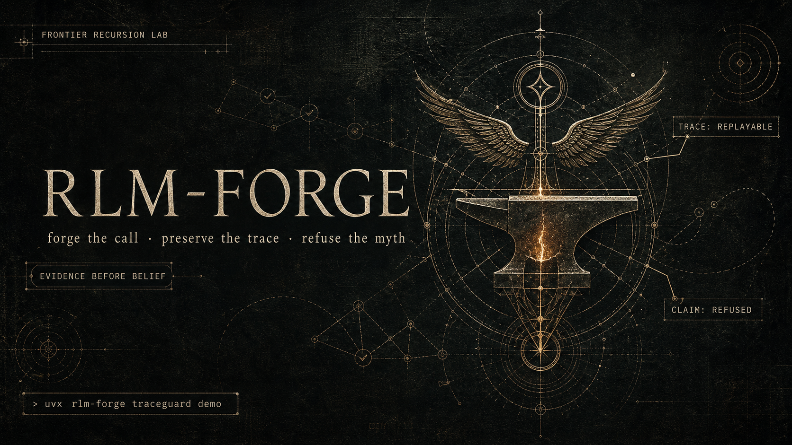
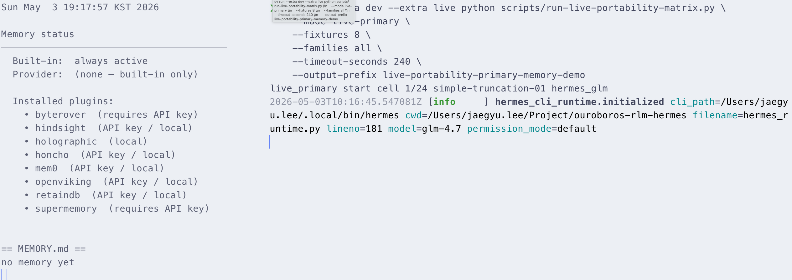

<p align="center">
  
</p>

<p align="center">
  
  
  
</p>

<h1 align="center">RLM-FORGE</h1>

<p align="center">
  <strong>A tiny recursive-runtime forge for Hermes Agent.</strong>
  <br />
  Ouroboros owns the recursion. Hermes performs bounded inner calls. TraceGuard refuses unsupported synthesis.
</p>

<p align="center">
  <a href="#quickstart">Quickstart</a>
  ·
  <a href="#what-this-proves">What this proves</a>
  ·
  <a href="#traceguard">TraceGuard</a>
  ·
  <a href="docs/architecture.md">Architecture</a>
  ·
  <a href="paper/main.pdf">Paper</a>
</p>

---

> **A Hermes-backed field instrument for runtime-lifted Recursive Language Models.**  
> Inspired by Zhang/Kraska/Khattab — *Recursive Language Models* (arXiv 2512.24601).

```text
╭────────────────────────────────────────────────────────────────────╮
│                            RLM-FORGE                               │
│                                                                    │
│  user request                                                      │
│      │                                                             │
│      ▼                                                             │
│  Ouroboros outer scaffold       recursion · state · trace replay   │
│      │                                                             │
│      ▼                                                             │
│  Hermes Agent inner runtime      bounded JSON sub-calls            │
│      │                                                             │
│      ▼                                                             │
│  TraceGuard                    parent claims must cite evidence    │
╰────────────────────────────────────────────────────────────────────╯
```

<p align="center">
  
</p>

RLM-FORGE is not a new model architecture. It is a runtime-hosted realization of a Recursive Language Model style execution loop:

- **Hermes Agent** acts as the inner LM runtime.
- **Ouroboros** owns recursion, scheduling, state mutation, termination, and trace replay.
- **TraceGuard** validates that parent synthesis only claims facts backed by accepted child evidence handles.

The result is a compact, replayable, evidence-gated RLM scaffold built on top of the existing Hermes tool/runtime interface.

---

## What this proves

RLM-FORGE makes one careful claim:

> Recursive execution is useful when it creates structured evidence handles that an outer scaffold can validate. Recursion alone is not trusted.

On the current live Hermes long-context truncation fixture, recursive RLM and vanilla single-call Hermes are an honest **tie**:

| Metric | Vanilla single call | Recursive RLM |
| --- | ---: | ---: |
| Hermes sub-calls | 1 | 5 |
| Quality score | 1.00 | 1.00 |
| Score delta | — | +0.00 |
| `omitted_fact_safety_score` | 1.00 | 1.00 |
| `claimed_omitted_fact_ids` | `[]` | `[]` |
| `cited_retained_fact_ids` | `LC-001..LC-004` | `LC-001..LC-004` |

Earlier artifacts reported a `+0.20` RLM advantage because the scorer treated guarded residual-gap text such as “LC-005 and LC-006 cannot be claimed” as a positive omitted-fact claim. The claim-aware scorer fixes that. The contribution here is **not** a quality win on one fixture; it is the Hermes-backed recursive runtime path plus deterministic evidence enforcement.

Persisted artifact: [`benchmarks/rlm-long-context-truncation-v1.json`](benchmarks/rlm-long-context-truncation-v1.json)

Live primary portability:
[`experiments/live-portability-primary.md`](experiments/live-portability-primary.md)
runs 8 shared fixtures through three runtime/provider families using the same
RLM-FORGE+TraceGuard contract. This is a 24-cell primary matrix, not the full
96-cell baseline sweep. Latest aggregate status is **pass**: Hermes+GLM,
Claude Code, and Codex each complete and pass all 8 primary fixtures. The
runtime has also seen a concrete missing-handle failure class in an earlier
Hermes+GLM run; that class is now covered by a deterministic TraceGuard
repair/retry loop. If it recurs, the runtime has a recovery path instead of
only a reject-and-log path. The latest live run passes before repair is needed,
so the repair loop is evidence of the runtime control surface rather than a
claimed benchmark win in the latest matrix.

| Family | Model alias | Primary cells | Live result | Mean latency |
| --- | --- | ---: | --- | ---: |
| `hermes_glm` | `glm-4.7` via Z.AI | 8/8 pass | `pass` | 156s |
| `claude_code_opus47` | `opus` via Claude Code | 8/8 pass | `pass` | 69s |
| `codex_gpt55` | `gpt-5.5` via Codex CLI | 8/8 pass | `pass` | 53s |

Live portability smoke:
[`experiments/live-portability-smoke.md`](experiments/live-portability-smoke.md)
remains the 1-fixture adapter/auth check that preceded the primary run.

TraceGuard enforcement demo:
[`experiments/traceguard-demo.md`](experiments/traceguard-demo.md)
shows the new evidence gate in action. Safe parent synthesis is accepted,
an omitted fact is rejected with `unsupported_fact_id`, and chunk-only
evidence is rejected with `chunk_handle_without_fact`. This turns the main
claim from “we measured unsupported claims” into “we can enforce the evidence
contract at parent synthesis time.”

---

## Why Hermes

Hermes is unusually well-suited to this kind of runtime experiment:

| Hermes property | Why it matters for RLM-FORGE |
| --- | --- |
| Provider-agnostic runtime | The inner LM can be swapped with `hermes model` without changing the recursion scaffold. |
| Tool/RPC-shaped execution | Hermes' structured “one bounded task in, one result out” style maps naturally to RLM sub-call envelopes. |
| Quiet structured I/O | Ouroboros can call Hermes like a function and validate the resulting JSON. |
| Isolated subagent potential | Future RLM trees can expand horizontally through Hermes subagents instead of a single serial path. |

RLM-FORGE treats Hermes as the only recursive inference boundary. Hermes proposes local decomposition, atomic execution, summary, or synthesis for one bounded node. Ouroboros alone decides recursion, mutation, retry, and termination.

---

## TraceGuard

TraceGuard is the small deterministic layer that turns a trace into an enforceable contract.

```python
from rlm_forge import build_manifest_from_fixture, validate_parent_synthesis

result = validate_parent_synthesis(
    evidence_manifest=build_manifest_from_fixture(fixture),
    parent_synthesis=parent_json,
)
```

Representative no-API output:

```text
safe_parent_synthesis: ACCEPT (unsupported_claim_rate=0.0000)
unsafe_omitted_fact: REJECT (unsupported_claim_rate=0.2000)
chunk_only_no_fact: REJECT (unsupported_claim_rate=1.0000)
```

TraceGuard rejects two important failure modes:

| Failure mode | Rejection reason |
| --- | --- |
| Parent claims an omitted fact not present in accepted child evidence | `unsupported_fact_id` |
| Parent cites a chunk handle but no supported fact | `chunk_handle_without_fact` |

Demo artifact: [`experiments/traceguard-demo.md`](experiments/traceguard-demo.md)

---

## Quickstart

RLM-FORGE requires **Python 3.12+**.

### 1. Install Hermes

```bash
curl -fsSL https://raw.githubusercontent.com/NousResearch/hermes-agent/main/scripts/install.sh | bash
source ~/.bashrc       # or ~/.zshrc
hermes setup           # configure provider + API key
hermes --version       # confirm v0.11+
```

The simplest provider for judges is OpenRouter: set `OPENROUTER_API_KEY` and select any model.

### 2. Install RLM-FORGE

```bash
git clone https://github.com/Q00/rlm-forge.git
cd rlm-forge
python3.12 -m venv .venv
source .venv/bin/activate
pip install -e '.[dev]'
```

The package pins a git-ref dependency on the Ouroboros commit that contains the RLM modules and claim-aware scorer until those APIs are released on PyPI.

### 3. Verify without a Hermes API key

```bash
pytest -q
python3 -m rlm_forge.replay benchmarks/rlm-long-context-truncation-v1.json
python3 scripts/run-traceguard-demo.py
```

Expected replay signal:

```text
quality: vanilla=1.00, rlm=1.00, delta=+0.00, rlm_outperforms_vanilla=False
```

### 4. Run the live truncation benchmark

```bash
ooo rlm --truncation-benchmark
```

This command performs one vanilla Hermes call plus five recursive Hermes sub-calls. Use the replay command above for no-API evaluation.

Expected live shape:

```text
Shared truncation benchmark completed; vanilla Hermes and recursive RLM outputs were recorded.
hermes_subcalls: vanilla=1, rlm=5
chunks: selected=4, omitted=2
quality: vanilla=1.00, rlm=1.00, delta=+0.00, rlm_outperforms_vanilla=False
```

---

## Two integration paths

| Path | Entry point | Where Hermes is called |
| --- | --- | --- |
| Recursive scaffold | `ooo rlm --truncation-benchmark` | `ouroboros.rlm.loop.RLMOuterScaffoldLoop` drives 1 root + 4 chunk sub-calls through `HermesCliRuntime`. |
| AC decomposition pipeline | `decompose_ac(hermes_runtime=...)` | `ouroboros.execution.decomposition.decompose_ac` accepts an `AgentRuntime` and delegates child-AC generation to Hermes. |

The default `ooo run` and `ooo evolve` flows keep their original LLM-only behaviour. Passing `hermes_runtime=None` bypasses every RLM-specific branch.

---

## Evidence map for judges

| Claim | Artifact |
| --- | --- |
| TraceGuard enforces parent synthesis evidence handles | [`experiments/traceguard-demo.md`](experiments/traceguard-demo.md) |
| Evidence-gated recursion is the mechanism, not recursion alone | [`experiments/unsupported-claim-rate-benchmark.md`](experiments/unsupported-claim-rate-benchmark.md) |
| Claim-aware scorer avoids the earlier false win | [`experiments/claim-aware-omitted-fact-suite.md`](experiments/claim-aware-omitted-fact-suite.md) |
| Broad deterministic scorer coverage | [`experiments/synthetic-omitted-fact-benchmark.md`](experiments/synthetic-omitted-fact-benchmark.md) |
| Live Hermes fixture remains an honest tie | [`benchmarks/rlm-long-context-truncation-v1.json`](benchmarks/rlm-long-context-truncation-v1.json) |
| 24-cell live primary portability matrix | [`experiments/live-portability-primary.md`](experiments/live-portability-primary.md) |
| Three-family runtime portability smoke | [`experiments/live-portability-smoke.md`](experiments/live-portability-smoke.md) |
| Architecture boundary | [`docs/architecture.md`](docs/architecture.md) |
| Hermes setup notes | [`docs/hermes-setup.md`](docs/hermes-setup.md) |
| Technical note | [`paper/main.pdf`](paper/main.pdf) |

Offline replay, scorer, TraceGuard, and deterministic ablation artifacts do
not require a Hermes API key. The live portability artifacts are persisted for
inspection; rerunning them requires provider credentials. TraceGuard improves
unsupported-claim enforcement; it does not change the live fixture quality
score, which remains a tie.

Additional scorer experiment:
[`experiments/claim-aware-omitted-fact-suite.md`](experiments/claim-aware-omitted-fact-suite.md)
runs seven controlled completion shapes without Hermes. It verifies that the
corrected scorer accepts guarded gap mentions but rejects positive omitted-fact
claims and omitted evidence references.

Broader scorer stress test:
[`experiments/synthetic-omitted-fact-benchmark.md`](experiments/synthetic-omitted-fact-benchmark.md)
generates 108 truncation fixtures and scores seven deterministic completion
strategies, for 756 total scorer checks. It is not a live-model benchmark; it
supports the narrower claim that the evaluation harness separates guarded gap
mentions, unsupported omitted-fact claims, chunk-only citations, and missing
boundary reports across many fixture shapes.

Contract ablation:
[`experiments/unsupported-claim-rate-benchmark.md`](experiments/unsupported-claim-rate-benchmark.md)
compares six execution contracts over 72 generated fixtures. The
evidence-gated Hermes-RLM contract has a 0.0000 unsupported-claim rate, while
the same recursive shape without evidence gating has a 1.0000 unsupported-claim
rate. This supports the precise systems claim: recursion is useful because it
creates evidence handles that Ouroboros can validate, not because recursion
alone makes hallucination impossible.

---

## What the live experiment proves

The 24-cell live run is a systems experiment, not a leaderboard. Its purpose
is to test whether an RLM-style child/parent contract can run across real
agent runtimes while a deterministic validator controls what may become parent
state.

The useful result is not "all models got the answer right." The useful result
is that RLM-FORGE exposes a runtime surface:

1. child calls return structured facts with evidence handles;
2. parent synthesis must cite those handles;
3. TraceGuard rejects parent claims that lack accepted evidence;
4. the same contract can be exercised through Hermes, Claude Code, and Codex.

The chunk-only citation trap is the useful stress case. In an earlier
Hermes+GLM run, GLM preserved the fact text but emitted one
`evidence_chunk_id` as `null`; TraceGuard rejected that parent claim before it
could become accepted state. The latest full rerun passes this cell because
GLM includes the required handle. The important point is that the runtime now
has a narrow response if that observed class recurs: when rejection is
exclusively `missing_evidence_handle`, the repair loop fills only missing/null
handle fields from the child evidence manifest and retries parent synthesis
once. This turns the observed failure from a terminal contract failure into a
bounded, inspectable recovery step.

TraceGuard is not an LLM judge. It does not ask another model whether the
answer "seems correct." It checks the manifest deterministically:

```text
fresh child evidence + fact_id + evidence_chunk_id -> accepted parent claim
missing handle / omitted fact / chunk-only citation -> rejected parent claim
```

---

## Repository layout

```text
rlm-forge/
├─ src/rlm_forge/
│  ├─ traceguard.py       # evidence-gated parent synthesis validator
│  ├─ replay.py           # offline artifact replay CLI
│  └─ __init__.py         # public API surface
├─ tests/                 # no-API CI tests
├─ experiments/           # deterministic scorer + TraceGuard artifacts
├─ benchmarks/            # persisted Hermes truncation benchmark
├─ docs/                  # architecture, setup, benchmark notes
├─ examples/              # small command wrappers
└─ paper/                 # hackathon technical note
```

---

## Toward memory-shaped recursion

RLM-FORGE currently treats each run as an isolated recursive execution. Hermes
makes a stronger future direction possible: decomposition traces,
provider-specific failures, schema repairs, and TraceGuard rejections can
become persistent operational priors for later recursive runs.

The important rule is:

```text
Memory is not evidence; memory is a prior over how to ask for evidence.
```

In that framing, Hermes memory should not store "this fixture's answer is X."
It should store operational lessons such as:

- long-context preservation tasks work better when child outputs preserve
  `fact_id` and `evidence_chunk_id` together;
- a provider may be slow but schema-stable, or fast but prone to handle
  omissions;
- TraceGuard rejection patterns can drive retry prompts or stricter child
  schemas;
- routing can specialize over time: decomposition, evidence extraction,
  synthesis, and repair may prefer different providers.

This creates a feedback loop without training a new model. TraceGuard failure
records become repair signals for the next recursive run, while every new
parent claim still has to cite fresh child evidence. To keep benchmarks clean,
future memory-enhanced runs should separate no-memory baselines from
trace-memory policy runs, disable answer-memory recall, and exclude fixture
content from durable memory.

---

## What RLM-FORGE is and is not

| It is | It is not |
| --- | --- |
| A Hermes-backed RLM runtime MVP | A new model architecture |
| A replayable trace and evidence-validation scaffold | A claim that recursion alone prevents hallucination |
| A practical integration recipe for Hermes + Ouroboros | A production RLM service |
| A deterministic TraceGuard enforcement demo | A benchmark suite proving model-quality superiority |

This is an MVP designed to demonstrate that Hermes can serve as the inner
recursive LM in an RLM-style scaffold with replayable traces and deterministic
evaluation. It is not a production-ready RLM service, does not claim novelty
over the Zhang et al. paper, and no longer claims a quality advantage from the
single truncation fixture. Future Hermes memory should improve decomposition,
routing, and repair policy only; it must not replace fresh trace evidence for
parent claims.

---

## Development

```bash
python3.12 -m venv .venv
source .venv/bin/activate
pip install -e '.[dev]'
pytest -q
```

Current local verification:

```text
55 passed
```

---

## Examples

| Script | What it does | Hermes calls |
| --- | --- | --- |
| `examples/01-dry-run.sh` | Validate the RLM path, no side effects | 0 |
| `examples/02-vanilla-baseline.sh` | One vanilla Hermes call on the truncation fixture | 1 |
| `examples/03-truncation-comparison.sh` | Side-by-side vanilla vs recursive RLM | 1 + 5 |

Each script is a one-liner that wraps the Ouroboros CLI.

---

## Architecture

See [`docs/architecture.md`](docs/architecture.md) for the layer model,
orchestration boundaries, and 6-step sub-call lifecycle. The full concept
design is `docs/guides/recursive-language-model.md` in the upstream
Ouroboros repository (1,580 lines).

```
User
  |
  v
ooo rlm
  |
  v
Ouroboros outer scaffold
  - validates ambiguity <= 0.2
  - owns ACTree recursion, max depth 5
  - owns RLM tree state, scheduling, termination, trace persistence
  - calls Hermes through HermesCliRuntime
  |
  v
Hermes inner LM layer
  - receives one bounded recursive sub-call at a time
  - proposes decomposition, atomic execution, summary, or synthesis
  - returns structured JSON evidence to Ouroboros
```

---

## License

MIT. See [`LICENSE`](LICENSE).

## Acknowledgements

- **Hermes Agent** — Nous Research. The inner runtime that made the experiment practical.
- **Ouroboros** — the outer scaffold that owns recursion, state, and traces.
- **Zhang, Kraska, Khattab** — *Recursive Language Models*, the conceptual seed for this work.
